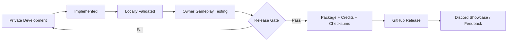

# GAMMA Mod Releases

Public releases, installation notes, compatibility information, and user-facing documentation for my **S.T.A.L.K.E.R. Anomaly / GAMMA** mod projects.

> **Release hub only.** Development work, experiments, local diagnostics, private test builds, rollback material, and unreleased engine work are kept out of this repository.

## Current release status

There are **no public download releases published from this repository yet**. Projects are moved here only after they have passed the appropriate gameplay testing, packaging, provenance, and redistribution checks.

| Project | Public status | Notes |
| --- | --- | --- |
| **One Key Light 2.0** | Release preparation | Gameplay-tested / final-for-now in private development. Public packaging and redistribution review still required. |
| **Unified Player Light Controls 2.0** | Release preparation | Gameplay-tested / final-for-now in private development. Public packaging and redistribution review still required. |
| **Beef's NVG Automatic Gain Control** | Testing | v0.4 Bodycam diagnostic is deployed for owner gameplay testing; not approved for public release yet. |
| **Grenades Expanded** | Development | Core is locally validated and partially gameplay-tested; public release gate not yet complete. |
| **GEKF / Universal Input & Action Framework** | Future | Architecture approved; implementation has not started on the maintained engine baseline. |

## What will be published here

When a project clears its release gate, its public release will include only the material that is actually approved for redistribution:

- packaged mod files;
- installation and upgrade instructions;
- versioned changelog;
- compatibility notes;
- known issues;
- credits and required upstream attribution;
- checksums where useful;
- rollback / uninstall instructions when the mod changes shared runtime files.

Private development history and machine-specific files will not be mirrored here.

## Release channels

- **Stable** — owner gameplay-tested and suitable for normal use.
- **Release Candidate** — feature-complete candidate that still needs broader confirmation.
- **Diagnostic / Test** — normally remains private and is not a public release channel unless explicitly approved.

## Planned public workflow

See the [public roadmap and checklist](ROADMAP.md) for the current release-facing plan.

## Installation philosophy

Each release will document its own requirements and installation order. Do not assume that files from one project can be copied into another or that a custom engine binary is interchangeable with another engine build.

For engine-dependent releases, the release notes will identify the exact supported engine lineage and required compatibility state.

## Issues and feedback

Once public releases are available, use this repository's Issues page for reproducible release bugs and compatibility reports. Include the mod version, GAMMA/Anomaly version, relevant dependencies, and steps to reproduce.

## Disclaimer

This is an independent community modding project and is not affiliated with or endorsed by GSC Game World or the GAMMA team. Upstream licenses, permissions, and attribution requirements remain applicable to any redistributed material.
