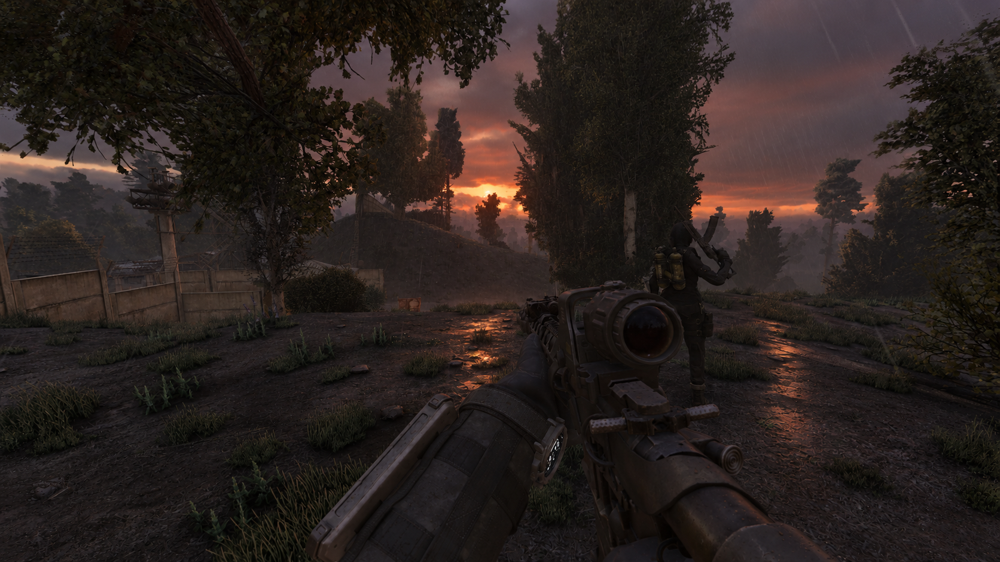

  

# GAMMA Mod Releases

Player light controls and community projects for **S.T.A.L.K.E.R. Anomaly / GAMMA**.

The Light 2.1.0 firing correction passed all **10 owner gameplay tests**. Public downloads are held while bundled-file redistribution review is completed.

## One Key Light 2.1.0

Control your installed lights with one key: **Tap, Double Tap, Hold**, or the **Quick Light Menu**. Works independently; add Unified for advanced modes and NVG linking.

- Configurable gestures, menu themes and readable device states.
- Normal/IR headlamp support, weapon lights and optional laser integration.
- Explicit vanilla Torch binding clear/restore.

**Public status: release held.**

[Download status](mods/One-Key-Light/README.md#download) · [Install](mods/One-Key-Light/INSTALL.md) · [Requirements](mods/One-Key-Light/COMPATIBILITY.md) · [Features](mods/One-Key-Light/FEATURES.md) · [Changelog](mods/One-Key-Light/CHANGELOG.md)

## Unified Player Light Controls 2.1.0

Keep light modes and tuning consistent across native controls and supported device dialogs. Link visible/IR channels to NVG state, with AUTO for supported weapon lights and lasers.

- Saved device modes and independent tuning.
- Separate or NVG Linked weapon/headlamp routes.
- Works alone or with One Key's gestures and menu.

**Public status: release held.**

[Download status](mods/Unified-Player-Light-Controls/README.md#download) · [Install](mods/Unified-Player-Light-Controls/INSTALL.md) · [Requirements](mods/Unified-Player-Light-Controls/COMPATIBILITY.md) · [Features](mods/Unified-Player-Light-Controls/FEATURES.md) · [Changelog](mods/Unified-Player-Light-Controls/CHANGELOG.md)

## In development

| Project | Status |
| --- | --- |
| [Auto NVG](mods/Beefs-NVG-Automatic-Gain-Control/README.md) | v0.4 partially tested; v0.4.1 exposure correction planned; no download |
| [Grenades Expanded](mods/Grenades-Expanded/README.md) | In development |
| GEKF | Future framework; not implemented on the maintained engine base |

## Help

[Installation guide](docs/INSTALLATION-GUIDE.md) · [Troubleshooting](docs/TROUBLESHOOTING.md) · [Report a bug](https://github.com/ProfessorMaterialistic/GAMMA-Mod-Releases/issues/new/choose) · [Mod index](docs/MOD-INDEX.md) · [Visual roadmap](ROADMAP.md)

Showcase recording **complete** · Discord posting **pending**. [Showcase checklist](docs/LIGHT-SHOWCASE-CHECKLIST.md).

[Credits](CREDITS.md) · [Release policy](RELEASE-POLICY.md) · [Redistribution review](docs/LIGHT-REDISTRIBUTION-REVIEW.md)

Independent community project; no affiliation or endorsement by GSC Game World or the GAMMA team.
