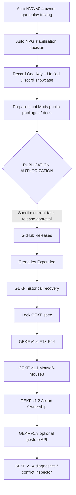

# Public roadmap

[Home](README.md) · [Release workflow](docs/RELEASE-WORKFLOW.md)

Updated 2026-10-04. Priority order is a plan, not evidence of implementation or permission to publish.

## Auto NVG acceptance and stabilization

- [ ] Owner verifies preserved Bodycam settings, camera/free aim, PiP, scopes and ordinary gameplay.
- [ ] Verify coherent full-image response across sky, terrain, interiors and near/weapon geometry.
- [ ] Gen 1 remains manual; Gen 2 slower/weaker with larger localized halo/washout/slower recovery; Gen 3 faster/stronger with tighter halo/less washout/faster recovery.
- [ ] Check no obvious pumping; retest Classic Beef/Better, Tap Toggle, Hold Toggle, five gain positions, persistence, endpoint no-op and hold-repeat suppression on v0.4.
- [ ] Exercise off/on, generation changes, save/load, level transition, practical resource/resolution recreation and a longer session.
- [ ] Owner decides stabilization; no automatic TESTED promotion. Auto NVG is **NOT PUBLICLY RELEASED**.

## Light Mods presentation and preparation

- [x] One Key Light 2.0 and Unified Player Light Controls 2.0: TESTED / FINAL-FOR-NOW for the accepted setup.
- [x] Document features, controls, FOMOD options, dependencies, install/update/removal and verified file priority.
- [ ] After Auto NVG reaches a stable stopping point, [record the short Discord showcase](docs/LIGHT-SHOWCASE-CHECKLIST.md).
- [ ] Select clean final packages; reconcile final delivery metadata with these docs.
- [ ] Clear [component redistribution review](docs/LIGHT-REDISTRIBUTION-REVIEW.md); finalize notices, credits and checksums.
- [ ] Place the selected screenshot at `assets/README-banner.png`.
- [ ] Obtain current explicit public-write and **specific release** authorization.
- [ ] Create versioned GitHub Releases only after that authorization.
- [ ] Share community announcement only with explicit posting authorization.

The showcase does not add a TESTED gate. Keep implementation parked unless recording reveals a real bug.

## Grenades Expanded

- [ ] Complete remaining grenade/select/throw/crafting/lifecycle acceptance.
- [ ] Finish radial design (IDEA) and explicitly lock the spec before implementation.
- [ ] Validate/test any implementation; complete packaging/redistribution/authorization gates.

## GEKF

- [ ] Establish stable maintained Bodycam/MT baseline.
- [ ] Recover actual historical documentation and engine diffs; distinguish old detection evidence from a finished binding system.
- [ ] Lock the current implementation spec.
- [ ] v1.0: first-class F13-F24 binding.
- [ ] v1.1: Mouse6-Mouse8.
- [ ] v1.2: transactional Action Ownership.
- [ ] v1.3: optional gesture API.
- [ ] v1.4: diagnostics / conflict inspector.

## States

IDEA = proposed; DECIDED = approved design; IMPLEMENTED = present in code; LOCALLY VALIDATED = applicable local checks passed; TESTED = actual owner gameplay evidence for the stated candidate/scope; FINAL-FOR-NOW = accepted tested state intentionally parked. PUBLIC RELEASE is a separate authorized distribution decision.
