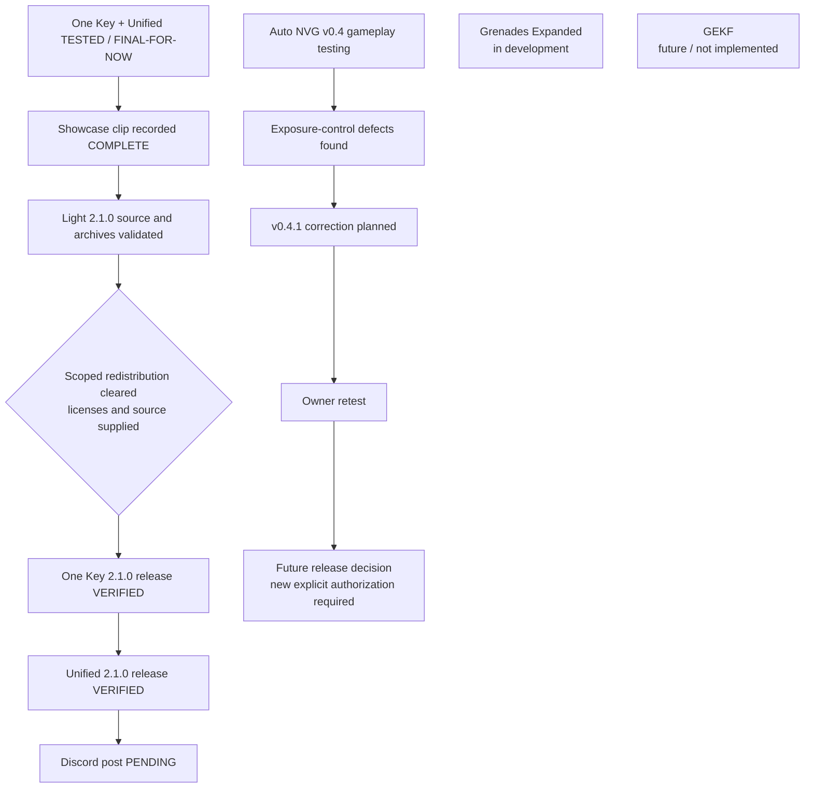

# Public roadmap

[Home](README.md) · [Showcase](docs/LIGHT-SHOWCASE-CHECKLIST.md) · [Release workflow](docs/RELEASE-WORKFLOW.md)

Light status updated 2026-10-10: both 2.1.0 Releases are live, with downloaded assets verified. Discord posting remains pending.

## Light releases and community

- [x] Both Light mods TESTED / FINAL-FOR-NOW for the accepted setup.
- [x] Owner recorded showcase clip.
- [x] Current task explicitly authorizes the two coordinated Light 2.1.0 releases.
- [x] Inspect behavior-preserved final package runtime, FOMOD and dependency file priority; prepare documentation and local archives.
- [x] Clear [exact bundled redistribution](docs/LIGHT-REDISTRIBUTION-REVIEW.md).
- [x] Publish [One Key Light 2.1.0](https://github.com/ProfessorMaterialistic/GAMMA-Mod-Releases/releases/tag/one-key-light-v2.1.0) and verify archive download.
- [x] Publish [Unified Player Light Controls 2.1.0](https://github.com/ProfessorMaterialistic/GAMMA-Mod-Releases/releases/tag/unified-player-light-controls-v2.1.0) and verify archive download.
- [x] Place exact approved [banner screenshot](assets/README.md).
- [ ] Post clip to Discord; no completed-post evidence supplied.

## Auto NVG

v0.4 underwent gameplay testing. Core Bodycam migration and controls worked in the tested scope. Exposure-control defects remain; **v0.4.1 correction is planned**, followed by owner retest and a future release decision. **No public download is available.**

## Grenades and GEKF

Grenades remains in development; radial design remains IDEA until explicitly locked. GEKF is a future framework with DECIDED architecture, not implemented on the maintained engine base. It follows a stable engine baseline, historical recovery and locked implementation spec.

## Evidence states

IDEA → DECIDED → IMPLEMENTED → LOCALLY VALIDATED → TESTED → FINAL-FOR-NOW. Never infer later states. Public release is a separate distribution decision. Future public changes require new explicit current-task authorization.
