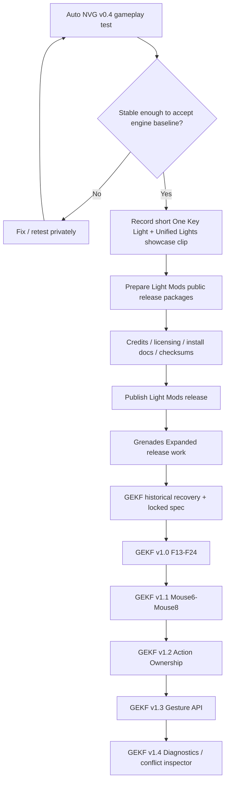

# Public Release Roadmap

This is the **public-facing release map**. It intentionally does not expose private implementation notes, local paths, unreleased binaries, or internal rollback material.

## Visual map

## Immediate checklist

### 1. Auto NVG v0.4 — gameplay acceptance
- [ ] Confirm Bodycam saved settings are intact.
- [ ] Confirm normal camera / free aim behavior.
- [ ] Confirm PiP / scopes behave correctly.
- [ ] Confirm full-image NVG exposure is coherent across sky, terrain, interiors, and weapon geometry.
- [ ] Confirm Gen 1 remains manual.
- [ ] Confirm Gen 2 is slower/weaker with stronger localized halo/washout.
- [ ] Confirm Gen 3 is faster/stronger with tighter halo and better recovery.
- [ ] Retest input styles and gain positions on the exact v0.4 candidate.
- [ ] Exercise off/on, generation changes, save/load, level transitions, and a longer session.
- [ ] Decide whether v0.4 is stable enough to become the maintained engine baseline.

### 2. Light Mods — short Discord showcase
After Auto NVG testing reaches a stable stopping point:

- [ ] Record a short clean in-game clip of **One Key Light 2.0**.
- [ ] Show Tap / Double Tap / Hold behavior clearly.
- [ ] Show the quick-light menu if appropriate.
- [ ] Show UTLF white light / IR / laser behavior.
- [ ] Show **Unified Player Light Controls 2.0** behavior.
- [ ] Keep the clip short enough for easy Discord viewing.
- [ ] Verify the recording does not expose debugging overlays or unrelated broken behavior.
- [ ] Post/share the clip on Discord.

This is a presentation/community task. The Light Mods remain **TESTED / FINAL-FOR-NOW** unless recording exposes a real bug.

### 3. Light Mods — public release preparation
- [ ] Audit redistributed files and permissions.
- [ ] Prepare clean public packages.
- [ ] Write installation / upgrade / uninstall instructions.
- [ ] Document required and optional dependencies.
- [ ] Write compatibility / known-issues section.
- [ ] Produce release checksums.
- [ ] Add credits and upstream attribution.
- [ ] Publish versioned GitHub Releases.

### 4. Grenades Expanded
- [ ] Complete remaining gameplay acceptance.
- [ ] Finish radial-menu design before implementation.
- [ ] Lock the implementation spec when design is mature.
- [ ] Complete implementation and validation.
- [ ] Run public-release licensing / packaging gate.

### 5. GEKF / Universal Input & Action Framework
- [ ] Recover and verify historical GEKF docs and old engine diffs.
- [ ] Confirm what was demonstrated historically versus what remained unresolved.
- [ ] Lock the implementation specification.
- [ ] v1.0: F13-F24 first-class MCM bindings.
- [ ] v1.1: Mouse6-Mouse8.
- [ ] v1.2: transactional vanilla Action Ownership.
- [ ] v1.3: optional Tap / Double Tap / Hold API.
- [ ] v1.4: binding / ownership diagnostics and conflict inspector.

## State definitions used here

- **IDEA** — proposed, not approved.
- **DECIDED** — approved design or requirement.
- **IMPLEMENTED** — present in source.
- **LOCALLY VALIDATED** — passed local/static/automated validation.
- **TESTED** — confirmed working through owner gameplay testing.
- **FINAL-FOR-NOW** — accepted current endpoint; reopen only for a bug, compatibility issue, or approved enhancement.

Public release is an additional packaging/licensing decision and is **not implied** by TESTED.
