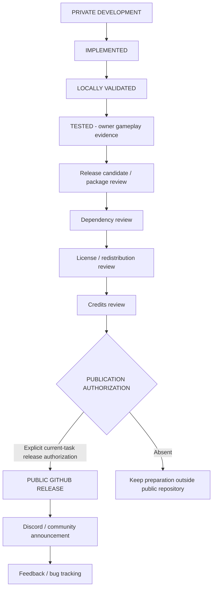

# Release workflow

[Release policy](../RELEASE-POLICY.md) · [Documentation standard](MOD-DOCUMENTATION-STANDARD.md)

## Preparation checklist

- [ ] Record exact version/source and owner gameplay evidence for affected behavior.
- [ ] Inspect the final archive's file list and FOMOD mappings; exclude development tools, settings, saves, backups, logs and unrelated content.
- [ ] Verify required/optional dependencies, supported versions and file winners; test exact installer choices.
- [ ] Complete [mod documentation](MOD-DOCUMENTATION-STANDARD.md), including update/removal and actual known issues.
- [ ] Resolve every exact component in the [redistribution review](LIGHT-REDISTRIBUTION-REVIEW.md), preserving notices and attribution.
- [ ] Check archive integrity and SHA-256 when useful; do not commit large archives.
- [ ] Report the exact files, target repository and release/tag/asset actions for approval.
- [ ] Obtain **current explicit public-documentation authorization** before any public-repository write, commit or push.
- [ ] Obtain **specific explicit release authorization** before any public tag, GitHub Release, archive, asset or binary publication.
- [ ] Review the staged/public privacy scan and reconcile any contradiction with private evidence before publication.
- [ ] Publish only the authorized version/assets; verify their final download contents and notes.
- [ ] Announce externally only when messaging/posting is also explicitly authorized.
- [ ] Track reproducible feedback without silently extending TESTED scope.

Preparation may be completed privately without public-write permission. Public documentation permission alone never authorizes release assets. The Light showcase is a presentation milestone, not an additional TESTED requirement. This workflow does not instruct an agent to publish automatically.
